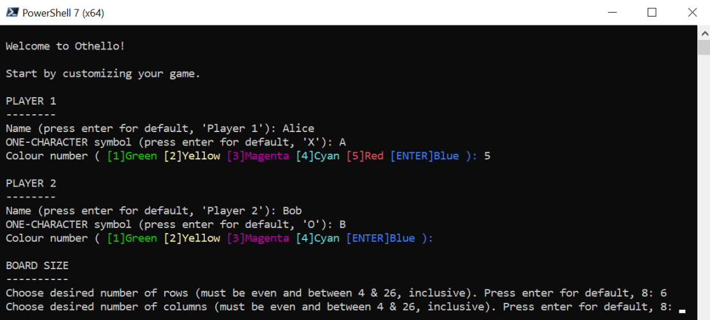
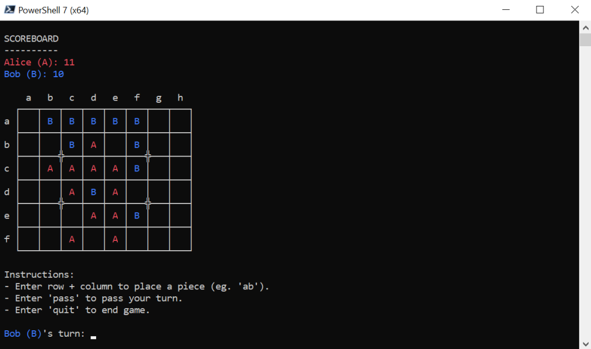

# Othello

A classic two-player board game brought to life on the console using object-oriented principles in C#. Complete with user customization of the game board and pieces. Submitted to *BME 121: Digital Computation*.

### Setup:

### Game board:

